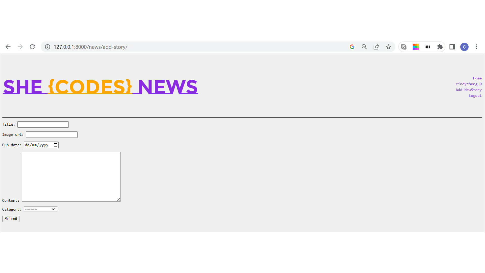
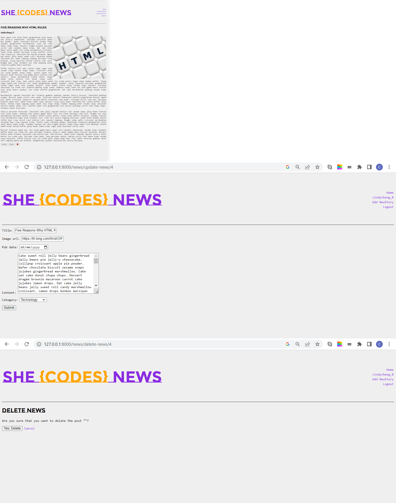

# Plus Resources: Django Project Starter

Starter code for the Plus Django project.
# Xiaoxin(Cindy) Cheng - She Codes News Project
## About This Project
I created a website for She Codes News! It allows Users to read news. A summary of the functionalities: you described:
-Reading News: Users can access and read news articles on the website.
-Author's News Creation: Authors have the ability to create new news articles. 
-Superuser's News Management: Superusers, who have administrative privileges, can update or delete news articles. 
-User Registration: Authors can sign up for a new account on the website.
## How To Run This Code
Terminal:`python manage.py runserver`. 
superuser-account:
   username:cindycheng_0
   password:12345
testuser-account:
   username:Thomas  
   password:Welcome@1234
## Database Schema
## Project Features
- [X] 1.1 Order stories by date

- [X] 1.2 Styled "new story" form

- [X] 1.3 Story images

- [X] 1.4 Log-in/log-out: logout redirects to home page

- [x] 1.5 "Account view" page

- [X] 1.6 "Create Account" page: Signup button for create new account

- [X] 1.7 View stories by author: Story details page can only be views by story author

- [x] "Log-in" button only visible when no user is logged in/"Log-out" buttononly visible when a user *is* logged in

- [x] "Create Story" functionality only available when user is logged in

## Additional Features:
- [X] 2.1 Add categories to the stories and allow the user to search for stories bycategory.

- [X] 2.2 Add the ability to update and delete stories (consider permissions - whoshould be allowed to update or and/or delete stories): only super user can update/delete story

- [?] 2.3 Add the ability to “favourite” stories and see a page with your favouritestories.

   Funtionable displaying user favourite news page;
   Struggling on adding favorite stories to user when hit the 💖button, will working on it.
- [ ] Our form for creating stories requires you to add the publication date,update this to automatically save the publication date as the day thestory was first published (maybe you could then add a field to showwhen the story was updated).
- [ ] Gracefully handle the error where someone tries to create a new story whenthey are not logged in.
## Appreciation
Thank you Lead Mentor Carlie and Harry for your guidance and support throughout the project!

A big thank you to Mentors Reece, Ling, Aiden, and Chris for your valuable assistance and encouragement.

Without all of you, I wouldn't have been able to accomplish all of this. As someone with zero coding background, I'm proud of what I have achieved so far.

Although there were moments of feeling overwhelmed and uncertainties, I've come a long way since the beginning of the project. I'm determined to continue working on the code and complete all the planned features.

Thank you all once again for being amazing mentors and making Django journey possible!

